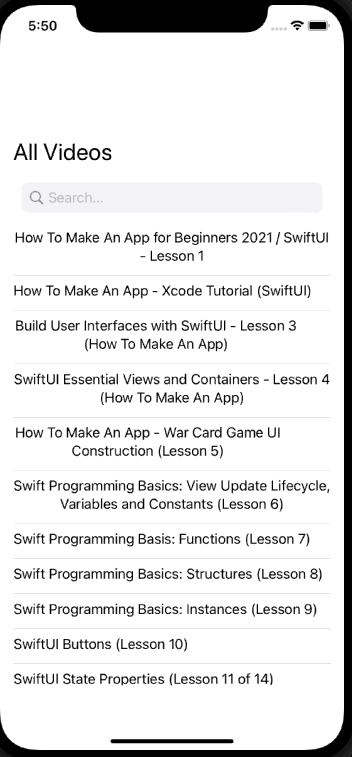

# Video List App
This simple app demonstrates how to fetch JSON data from a remote URL, then display another video it
pulls from GitHub Pages. 

App in response to the fantastic https://codewithchris.com iOS Foundations module 5 wrap-up challenge.

It also shows how to implement a search bar in SwiftUI thanks to the great tutorial by Simon Ng
 here: https://www.appcoda.com/swiftui-search-bar/ 

# App Design

